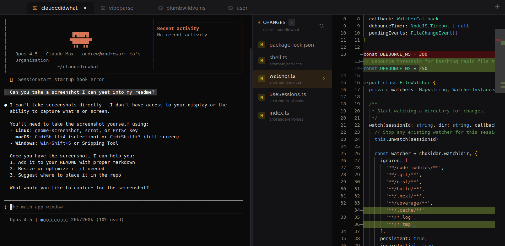

# Claude Did What?!

A multiplatform terminal emulator with an integrated code review/diff panel, designed for Claude Code workflows. Another artisanally hand-crafted AI slop project by Andrew Orr.



## Features

- **Split-pane layout**: Terminal on the left (50%), diff viewer on the right (50%), with resizable divider
- **Smart tab naming**: Tabs show git branch name, or directory name when on main/master or outside a git repo
- **Multi-tab support**: Manage multiple sessions with keyboard shortcuts
- **Real-time git diff**: Automatically detects and displays file changes with side-by-side file list
- **Monaco-powered diff view**: Syntax highlighting with side-by-side comparison
- **Cross-platform**: Works on macOS, Windows, and Linux
- **Obsidian Studio theme**: A refined dark theme with warm amber accents, JetBrains Mono typography, and polished micro-interactions

## Installation

### From Source

```bash
# Clone the repository
git clone https://github.com/xorrbit/claudedidwhat.git
cd claudedidwhat

# Install dependencies (automatically rebuilds native modules for Electron)
npm install

# Run in development mode
npm run dev

# Build for production
npm run build

# Package for your platform
npm run package:linux   # Linux (AppImage, deb)
npm run package:mac     # macOS (dmg)
npm run package:win     # Windows (exe)
```

> **Note**: The `postinstall` script automatically rebuilds `node-pty` for Electron. If you encounter native module errors, run `npx @electron/rebuild -f -w node-pty`.

### Pre-built Binaries

Download from the [Releases](https://github.com/xorrbit/claudedidwhat/releases) page.

## Usage

### Keyboard Shortcuts

| Shortcut | Action |
|----------|--------|
| `Ctrl+T` / `Cmd+T` | New tab |
| `Ctrl+W` / `Cmd+W` | Close tab |
| `Ctrl+Tab` | Next tab |
| `Ctrl+Shift+Tab` | Previous tab |
| `Ctrl+1-9` / `Cmd+1-9` | Switch to tab by number |
| `Ctrl+?` / `Cmd+?` | Show help overlay |

### Diff Panel

The diff panel on the right side features a side-by-side layout:
- **File list sidebar**: Shows changed files compared to the main branch with color-coded status indicators (Added, Modified, Deleted)
- **Diff viewer**: Click any file to view its diff with syntax highlighting
- **Branch-only changes**: Only shows files changed in your branch, not unrelated changes from main/master
- **Instant file switching**: Diff content is cached for fast navigation between files

Changes are detected in real-time as you edit files. The tab name automatically updates to reflect your current git branch or directory.

## Tech Stack

| Component | Technology |
|-----------|------------|
| Framework | Electron |
| Language | TypeScript |
| UI | React |
| Styling | Tailwind CSS + JetBrains Mono |
| Terminal | xterm.js |
| PTY | node-pty |
| Diff View | Monaco Editor |
| Git | simple-git |
| File Watching | chokidar |
| Testing | Vitest + Playwright |

## Development

```bash
# Run development server with hot reload
npm run dev

# Run unit tests (40 tests)
npm run test:unit

# Run E2E tests
npm run test:e2e

# Lint code
npm run lint

# Format code
npm run format
```

## Project Structure

```
claudedidwhat/
├── src/
│   ├── main/           # Electron main process
│   │   ├── ipc/        # IPC handlers (pty, git, fs)
│   │   └── services/   # Shell, git, PTY, watcher services
│   ├── renderer/       # React app
│   │   ├── components/ # UI components
│   │   ├── hooks/      # Custom React hooks
│   │   └── context/    # React context providers
│   ├── preload/        # Electron preload scripts
│   └── shared/         # Shared types
├── tests/
│   ├── unit/           # Vitest unit tests
│   └── e2e/            # Playwright E2E tests
└── resources/          # App icons
```

## Contributing

1. Fork the repository
2. Create a feature branch (`git checkout -b feature/amazing-feature`)
3. Commit your changes (`git commit -m 'Add amazing feature'`)
4. Push to the branch (`git push origin feature/amazing-feature`)
5. Open a Pull Request

## License

MIT
